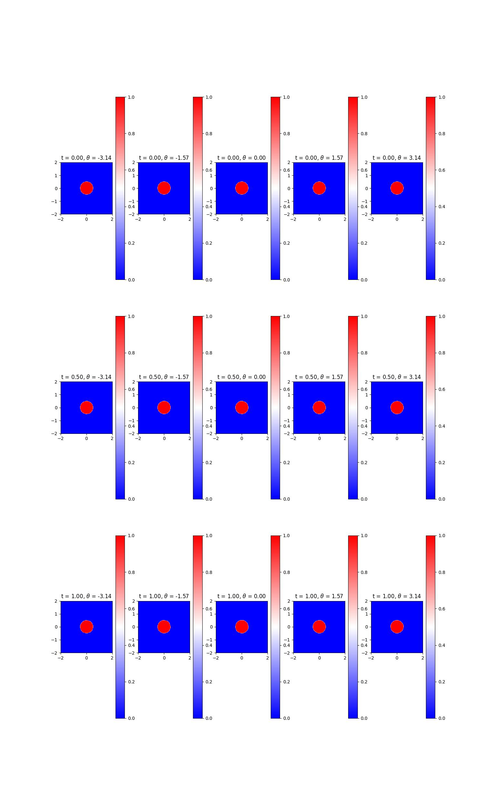
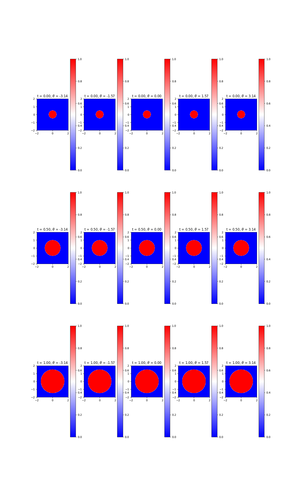
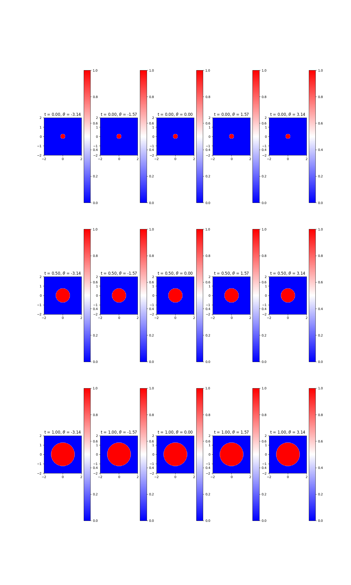

<head>
    <script src="https://cdn.mathjax.org/mathjax/latest/MathJax.js?config=TeX-AMS-MML_HTMLorMML" type="text/javascript"></script>
    <script type="text/x-mathjax-config">
        MathJax.Hub.Config({
            tex2jax: {
            skipTags: ['script', 'noscript', 'style', 'textarea', 'pre'],
            inlineMath: [['$','$']]
            }
        });
    </script>
</head>
# Using the DeepReach Toolbox to calculate the BRT for robot

Author<br>
[Zhang Haimingyue](https://myTristan.github.io/),
<br>
This repository provides the code for solving the safe set of a robot using the DeepReach Toolbox.

## Environment Setup
Create and activate a virtual python environment (env) to manage dependencies:
```
python -m venv env
env\Scripts\activate
```
Install DeepReach dependencies:
```
pip install -r requirements.txt
```
Install the appropriate PyTorch package for your system. For example, for a Windows system with CUDA 12.1:
```
pip3 install torch torchvision torchaudio --index-url https://download.pytorch.org/whl/cu121
```

## Running the DeepReach Experiment
We are supposed to use the Robot2D class in `dynamics.py`. To calcualte the BRT of the system, please run:
```
python run_experiment.py --mode train --experiment_class DeepReach --dynamics_class Robot2D --experiment_name robot2d_run1 --minWith target --goalR 0.5 --velocity 1.0 --angle_alpha_factor 1.2 --set_mode avoid
```
To calcualte the safe set, please run:
```
python run_experiment.py --mode train --experiment_class DeepReach --dynamics_class Robot2D --experiment_name robot2d_run2 --minWith target --goalR 0.5 --velocity 1.0 --angle_alpha_factor 1.2 --set_mode reach
```
To calculate the set of states from which the robot can surely reach the goal, please run:
```
python run_experiment.py --mode train --experiment_class DeepReach --dynamics_class Robot2D --experiment_name robot2d_run3 --minWith target --goalR 0.25 --velocity 1.0 --angle_alpha_factor 1.2 --set_mode reach
```

## Results
Some of the program's figures, models and the configurations, are stored in the `results/` directory.
The plot of the BRT of the system calculated by the DeepReach Toolbox is shown below. The red circle represents the states where a collision is unavoidable.

The plot of the safe set is shown below. The blue part represents the safe set.

The set of states from which the robot can surely reach the goal is shown below. The red circle represents these states.


## Reachability analysis
The DeepReach Toolbox is a powerful toolbox that can solve many reachability problems. Before we start, we need to define a `Robot2D` class that inherits from the abstract `Dynamics` class. To define the functions in the `Robot2D` class, we will use Hamilton-Jacobi reachability analysis.  
The dynamics of the robot are as follows:
```math
\left\{\begin{array}{l}
\dot x = v\cos(u)\\
\dot y = v\sin(u)\\
\end{array}
\right.\tag{1}
```
The $l(x)$ for this model is $l(x):=\Vert(x,y)\Vert-\beta$, and the Hamiltonian can be computed as follows:
```math\tag{2}
H(x,t) = p_1v\cos(u) + p_2v\sin(u)=v\sqrt{p_1^2+p_2^2}\sin(u+\phi),
```
```math
\phi=\arctan{\frac{p_1}{p_2}},
```
where $p_1$ and $p_2$ are the spatial derivative of the value function with respect to x and y respectively. Besides, the inequality $v\sqrt{p_1^2+p_2^2}\geq0$ always holds. Therefore, if we want to reach a goal, $\sin(u+\phi)$ needs to take the minimum value of -1, and at this point, $u$ equals $\frac{\pi}{2}-\phi$. Conversely, if we want to avoid a goal, $\sin(u+\phi)$ needs to take the maximum value of 1, and at this point, $u$ equals $-\frac{\pi}{2}-\phi$.   
To sum up, we can define the Hamiltonian used in the `Robot2D` class as follows:
```math\tag{3}
H(x,t)  =
\begin{cases}
-v\sqrt{p_1^2+p_2^2} & \text{if } mode=reach \\
v\sqrt{p_1^2+p_2^2} & \text{if } mode=avoid
\end{cases}
```
Next, we can set up the `Robot2D` class. The code is as follows:  
The `__init__` function initializes the goal and the velocity. Although the system is a 2D system, we still set the dimension to 3 in order to draw the figure. These three dimensions represent the x-coordinate, y-coordinate, and the heading of the robot.
```python
    def __init__(self, goalR:float, velocity:float, angle_alpha_factor:float, set_mode:str, freeze_model: bool):
        self.goalR = goalR
        self.velocity = velocity
        self.angle_alpha_factor = angle_alpha_factor
        self.freeze_model = freeze_model
        super().__init__(
            loss_type='brt_hjivi', set_mode=set_mode,
            state_dim=3, input_dim=4, control_dim=1, disturbance_dim=0,
            state_mean=[0, 0, 0], 
            state_var=[2, 2, self.angle_alpha_factor*math.pi],
            value_mean=0.25, 
            value_var=0.5, 
            value_normto=0.02,
            deepreach_model="exact"
        )
```

The `state_test_range` function sets the test range. From our intuitional analysis, we can set the range of x and y to be $[-2, 2]$, and set the range of $\theta$ to be $[-\pi, \pi]$.
```python
    def state_test_range(self):
        return [
            [-2, 2],
            [-2, 2],
            [-math.pi, math.pi],
        ]
```

The `dsdt` function calculates the derivatives of x and y.
```python
    def dsdt(self, state, control, disturbance):
        if self.freeze_model:
            raise NotImplementedError
        dsdt = torch.zeros_like(state)
        dsdt[..., 0] = self.velocity*torch.cos(control[..., 0])
        dsdt[..., 1] = self.velocity*torch.sin(control[..., 0])
        return dsdt
```
The `hamiltonian` function calculates the Hamiltonian from formula (3).
```python
    def hamiltonian(self, state, dvds):
        if self.freeze_model:
            raise NotImplementedError
        if self.set_mode == 'reach':
            return  - self.velocity*(torch.sqrt(dvds[..., 0]**2 + dvds[..., 1]**2))
        elif self.set_mode == 'avoid':
            return  self.velocity*(torch.sqrt(dvds[..., 0]**2 + dvds[..., 1]**2))
```
The `plot_config` function is used to plot the figure.
```python
    def plot_config(self):
        return {
            'state_slices': [0, 0, 0],
            'state_labels': ['x', 'y', r'$\theta$'],
            'x_axis_idx': 0,
            'y_axis_idx': 1,
            'z_axis_idx': 2,
        }
```
The complete implementation of the `Robot2D` class can be found in `dynamics.py`.
## References
```
@software{deepreach2024,
  author = {Lin, Albert and Feng, Zeyuan and Borquez, Javier and Bansal, Somil},
  title = {{DeepReach Repository}},
  url = {https://github.com/smlbansal/deepreach},
  year = {2024}
}
```

```
@inproceedings{bansal2020deepreach,
    author = {Bansal, Somil
              and Tomlin, Claire},
    title = {{DeepReach}: A Deep Learning Approach to High-Dimensional Reachability},
    booktitle = {IEEE International Conference on Robotics and Automation (ICRA)},
    year={2021}
}
```
## Contact
If there are any shortcomings in my answers, please feel free to email me (zhmy22@mails.tsinghua.edu.cn). I welcome your corrections.
